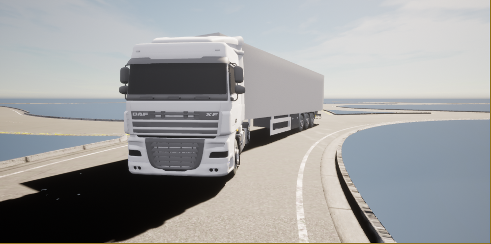
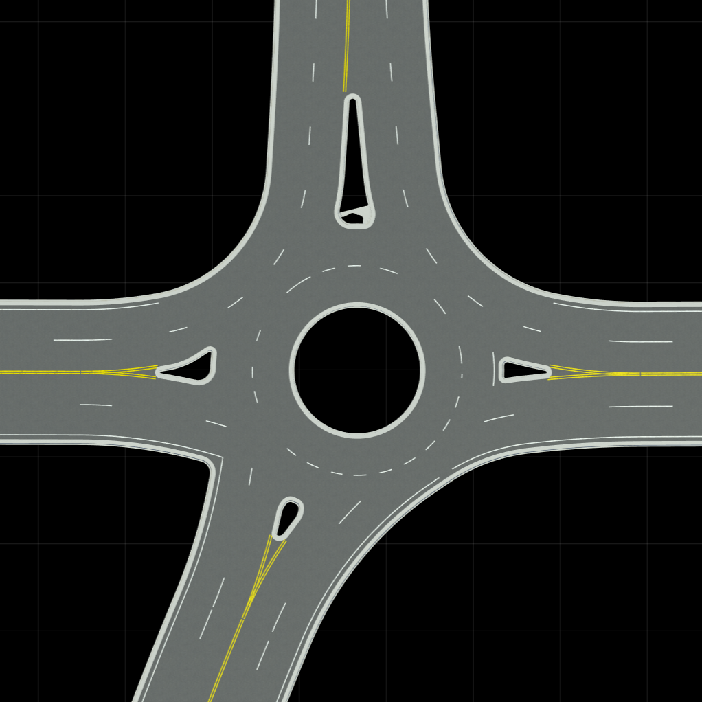
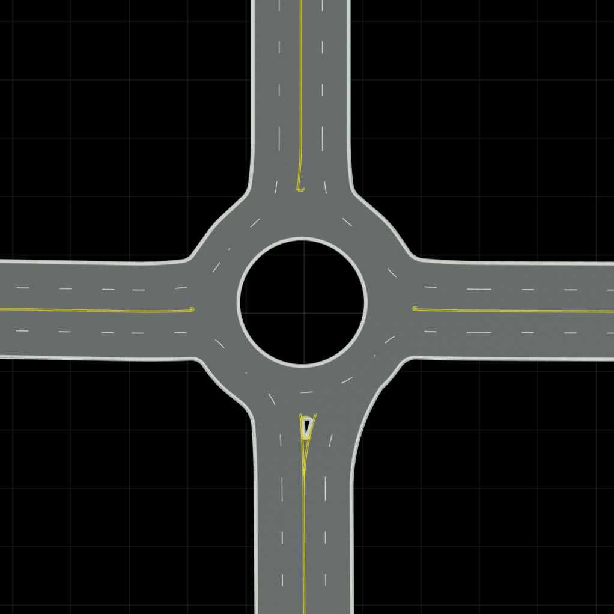
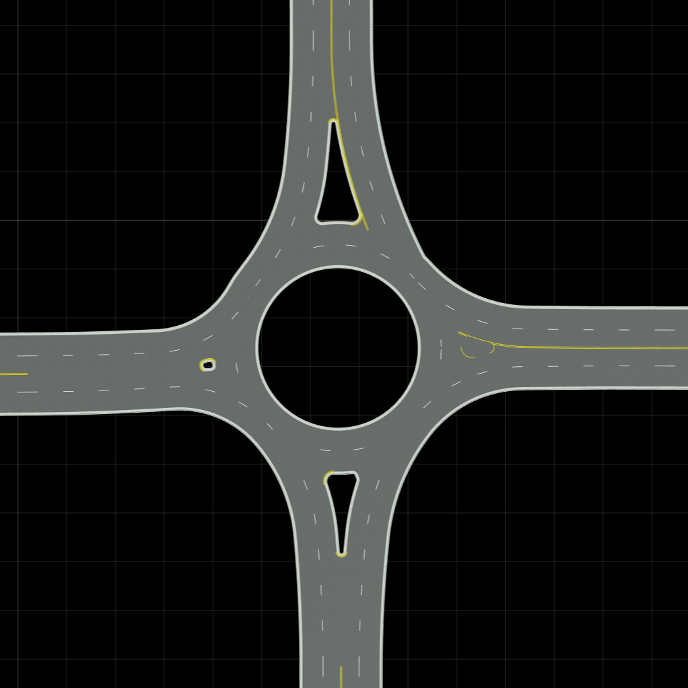
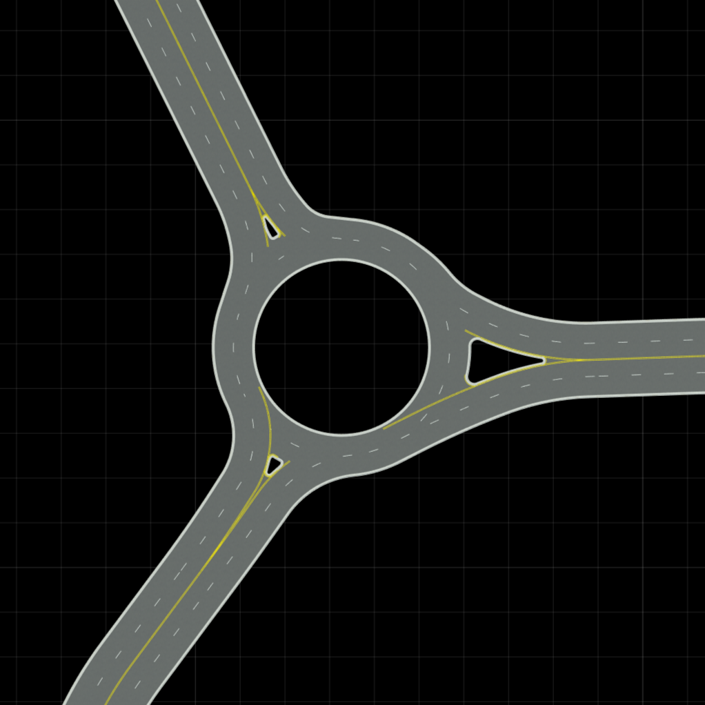
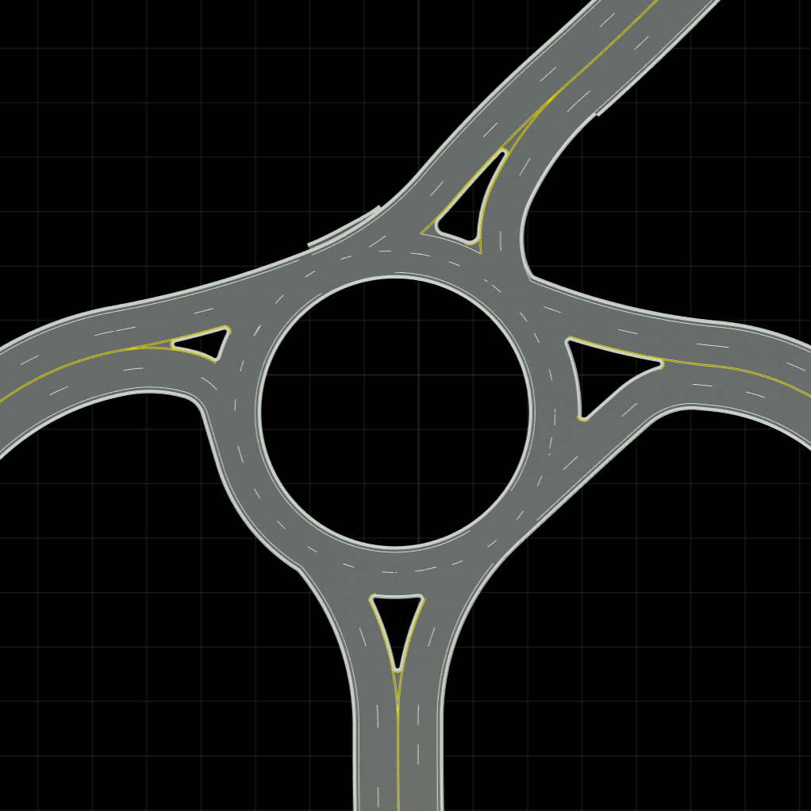

# Tractor Trailer Vehicle and Roundabout Dataset Carla

The following tractor-trailer vehicle and roundabout intersections were developed for research related to the autonomous navigation of tractor-trailer vehicle through roundabout intersections.
This work was presented at the Trustworthy AI for safe & secure traffic control in connected & autonomous vehicles (TACTFUL) workshop at the European Conference for Artificial Intelligence (ECAI) 2023 in Krakow, Poland:

<code> D. Attard and J. Bajada, “Autonomous Navigation of Tractor‐Trailer Vehicles through Roundabout Intersections,” presented at the Trustworthy AI for safe & secure traffic control in connected & autonomous vehicles (TACTFUL) workshop at the European Conference for Artificial Intelligence (ECAI), Poland, October 2023 </code>

A copy of the workshop paper can be found [here](D.Attard,J.Bajada.pdf) .

The artefacts were developed using Carla 0.9.12, Unreal Engine 4.26, and Linux 18.04. In order to use such artefacts, [CARLA](https://carla.org/) needs to be built from source by following these [instructions](https://carla.readthedocs.io/en/latest/build_carla/).

## Tractor-Trailer Vehicle
A tractor-trailer vehicle was developed based on work of Frank Engles found [here](https://github.com/frankeng/CarlaSemiTruckTrailer).
This updated model fixed all the issues mentioned by Frank and has no known bugs. The instruction provided by Engles should be used to include tractor-trailer vehicle in CARLA.

The files related to the tractor-trailer vehicle can be found under the *carla/Unreal/CarlaUE4/Content/Carla* directory. 

## Roundabout Dataset
A dataset of 5 roundabout intersections was developed using [RoadRunner](https://uk.mathworks.com/products/roadrunner.html). These varied in their diameters including 16m, 20m, 32m, 40m, and 50m. 4 of the roundabouts have 4 entry-exit points while one has 3 entry-exit points. The entry-exit points also differ in the angle at which they approach the roundabout. The roundabout intersections are defined using the OpenDrive standard.

The files related to the roundabout intersections can be found under the *carla/Unreal/CarlaUE4/Content/map_package* directory.

  
 